# Relatório do Projeto

## Preparação do Dataset e do Povoamento Inicial

Dado o dataset que nos foi disponibilizado (um ficheiro json para cada UC), decidimos juntar tudo em um único ficheiro json, em forma de array. Alteramos também os docentes, representando-os dentro da UC apenas com a sua sigla. Criamos também outro ficheiro json (que corresponde a outra coleção) para armazenar os docentes (que, neste caso, são utilizadores do sistema, com permissões de Docente, exceto o professor José Carlos Ramalho que tem permissões de AdminDocente (Docente + Administrador)).

Posteriormente, decidimos baixar todos os ficheiros relativos às 3 UCs que estavam presentes nos datasets, copiando-os para a pasta `public/filesUploaded/jcr`. Isto significa que os ficheiros foram carregados para o site pelo professor com a sigla `jcr` (mais abaixo é explicado como funciona o sistema de ficheiros).

Em relação à verificação de ficheiros contra o manifesto, achamos que não seria necessário neste contexto, dado que os docentes podem carregar qualquer tipo de ficheiro para a sua pasta (para disponibilizar nos sumários) e apenas o seu nome (do ficheiro) é necessário.

## Estrutura do Projeto

O projeto é uma aplicação web completa que integra várias partes para fornecer um sistema de gestão de Unidades Curriculares (UCs). A aplicação é composta por três componentes principais: API, Autenticação e Interface de Utilizador. Abaixo, uma visão detalhada:

```plaintext
/api-geradorUCs
    ├── auth
    │   └── auth.js
    ├── bin
    │   └── www
    ├── controllers
    │   └── uc.js
    ├── models
    │   └── uc.js
    ├── routes
    │   └── ucs.js
    ├── app.js
    ├── Dockerfile
    ├── Dockerfile-seed
    ├── ucs.json
    ├── users.json
    └── package.json

/auth-geradorUCs
    ├── auth
    │   └── auth.js
    ├── bin
    │   └── www
    ├── models
    │   └── user.js
    ├── routes
    │   └── index.js
    ├── app.js
    ├── Dockerfile
    └── package.json

/html-geradorUCs
    ├── aux
    │   └── auth.js
    ├── bin
    │   └── www
    ├── routes
    │   ├── files.js
    │   ├── index.js
    │   ├── ucs.js
    │   └── users.js
    ├── uploads
    ├── views
    │   ├── addUC.pug
    │   ├── editUC.pug
    │   ├── error.pug
    │   ├── files.pug
    │   ├── index.pug
    │   ├── layout.pug
    │   ├── listUsers.pug
    │   ├── login.pug
    │   ├── register.pug
    │   ├── success.pug
    │   └── uc.pug
    ├── public
    │   ├── filesUploaded
    │   ├── images
    |       └── users
    │   ├── javascripts
    │   ├── stylesheets
    │   └── favicon.ico
    ├── app.js
    └── Dockerfile

/docker-compose.yml
/export.sh
/import.sh
/install.sh
/uninstall.sh
/reinstall.sh
```

## Componentes Principais

### 1. Sistema de Autenticação (auth-geradorUCs)

#### Estrutura

- `models/user.js`: Define o schema do utilizador no MongoDB utilizando Mongoose e Passport-Local Mongoose.
- `routes/index.js`: Define os endpoints relacionados à autenticação e gestão de utilizadores.
- `auth/auth.js`: Middleware que implementa a verificação do token JWT.
- `app.js`: Configura a aplicação Express, conecta à base de dados MongoDB e inicializa as rotas.

#### Funcionalidades

1. **Registo de Utilizador**: Permite o registo de novos utilizadores.
2. **Login**: Autentica utilizadores e emite tokens JWT.
3. **Alteração da Palavra-Passe**: Permite a alteração de senha dos utilizadores autenticados.
4. **Verificação de Token**: Verifica a validade dos tokens JWT e identifica utilizadores.

#### Permissões

Existem 3 níveis de acesso (e mais 1 que combina 2 deles): Admin, Docente, Aluno e AdminDocente (que combina as permissões de Docente e Admin, logo, quando se falar em permissões de Administrador, o AdminDocente está incluído)

- **Listar Utilizadores**: Qualquer nível (omite-se, obviamente, os atributos sensíveis)
- **Adicionar acesso a uma UC**: Apenas Alunos (Administradores e Docentes já têm acesso a todas)
- **Registar Administrador, Administrador-Docente, ou Docente**: Apenas Administradores
- **Registar Aluno**: Qualquer nível
- **Apagar Utilizador**: Apenas Administradores
- **Alterar Palavra-Passe**: Apenas o utilizador que tem a sessão iniciada
- **Obter Utilizador**: Qualquer nível (omite-se, obviamente, os atributos sensíveis)

#### Dockerfile

1. Atribui à pasta do container `/usr/src/app` o diretório de trabalho

2. Copia o package.json para o diretório de trabalho

3. npm install

4. Copia o resto dos ficheiros para o container

5. Expõe a porta 3123

6. npm start

### 2. API de Gestão de UCs (api-geradorUCs)

A API é responsável por gerir as Unidades Curriculares (UCs). Utiliza o framework Express.js para construir endpoints RESTful que permitem a criação, leitura, atualização e eliminação (CRUD) de UCs.

#### Estrutura

- `models/uc.js`: Define o schema da UC no MongoDB usando Mongoose.
- `routes/ucs.js`: Define os endpoints relacionados às UCs.
- `app.js`: Configura a aplicação Express, conecta à base de dados MongoDB e inicializa as rotas.

#### Funcionalidades

1. **Criar UC**: Permite a criação de uma nova UC.
2. **Ler UCs**: Permite a obtenção de todas as UCs ou uma UC específica.
3. **Atualizar UC**: Permite a atualização dos dados de uma UC específica.
4. **Eliminar UC**: Permite a eliminação de uma UC específica.

#### Permissões

- **Listar UCs**: Qualquer nível, porém aos Alunos apenas lhes são devolvidas as UCs que têm acesso
- **Obter UC**: Qualquer nível, porém aos Alunos apenas lhe é permitido obter a informação de uma UC que tenha acesso
- **Atualizar UC**: Apenas Administradores ou o Docente Criador da UC
- **Eliminar UC**: Apenas Administradores ou o Docente Criador da UC

#### Dockerfiles

##### Dockerfile

1. Atribui à pasta do container `/usr/src/app` o diretório de trabalho

2. Copia o package.json para o diretório de trabalho

3. npm install

4. Copia o resto dos ficheiros para o container

5. Expõe a porta 3124

6. npm start

##### Dockerfile-seed

1. Atribui à pasta do container `/data` o diretório de trabalho

2. Copia os ficheiros `ucs.json` e `users.json` para o diretório de trabalho do container

### 3. Interface de Utilizador (html-geradorUCs)

#### Estrutura

- **views**: Contém os templates Pug para as diferentes páginas da aplicação.
- **routes**: Define as rotas que renderizam as páginas e processam formulários, verificando também as permissões.

#### Funcionalidades

1. **Página Inicial**: Exibe uma lista de UC com botões para ver detalhes, editar ou apagar. Permite a pesquisa por título e docente.
2. **Adicionar UC**: Formulário para adicionar novas UCs.
3. **Editar UC**: Formulário para editar UCs existentes.
4. **Gestão de Ficheiros**: Permite o upload, download e gestão de ficheiros do utilizador / servidor.
5. **Gestão de Utilizadores**: Permite aos gerir outros Docentes / Administradores (adicionar, eliminar).
6. **Alterar Palavra-Passe**: Formulário modal para alterar a palavra-passe.
7. **Obter Acesso a UC**: Formulário modal para inserir o código da UC para ter acesso à mesma.

#### Permissões

- **Gerir todos os Ficheiros do Servidor**: Apenas Administradores
- **Gerir os seus próprios Ficheiros**: Docente que têm a sessão iniciada e Administradores
- **Alterar Palavra-Passe**: O utilizador que tem a sessão iniciada
- **Gerir Docentes e Administradores**: Apenas Administradores
- **Obter Acesso a UC**: Apenas Alunos (Administradores e Docentes já têm acesso a todas as UCs)

#### Dockerfile

1. Atribui à pasta do container `/usr/src/app` o diretório de trabalho

2. Copia o package.json para o diretório de trabalho

3. npm install

4. Copia o resto dos ficheiros para o container

5. Expõe a porta 3123

6. npm start

## Configuração e Execução

### Pré-requisitos

- Docker
- Docker Compose

### Configuração do Ambiente

1. Instalação: Para instalar e configurar o projeto, utilize o script install.sh

```bash
./install.sh
```

2. Reinstalação: Para reinstalar o projeto, utilize o script reinstall.sh

```bash
./reinstall.sh
```

3. Desinstalação: Para desinstalar o projeto, utilize o script uninstall.sh

```bash
./uninstall.sh
```

### Utilização dos Scripts de Exportação e Importação

- Exportação de Dados: Para exportar dados do MongoDB, utilize o script export.sh

```bash
./export.sh <database_name>
```

- Importação de Dados (processo inverso): Para importar dados para o MongoDB, utilize o script import.sh

```bash
./import.sh <folder>
```

## Docker Compose

O ficheiro docker-compose.yml define os serviços necessários para a execução da aplicação.

### Serviços Definidos

- **mongo**: Serviço do MongoDB.
- **mongo-seed**: Serviço para popular o MongoDB com dados iniciais.
- **api-geradorucs**: Serviço da API de Gestão de UCs.
- **html-geradorucs**: Serviço da Interface de Utilizador.
- **auth-geradorucs**: Serviço de Autenticação.

## Screenshots do Site

### Página Inicial (não autenticado)

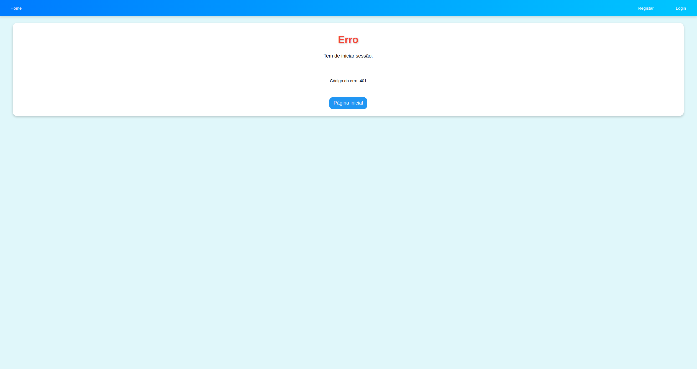

### Página Inicial (Docente)

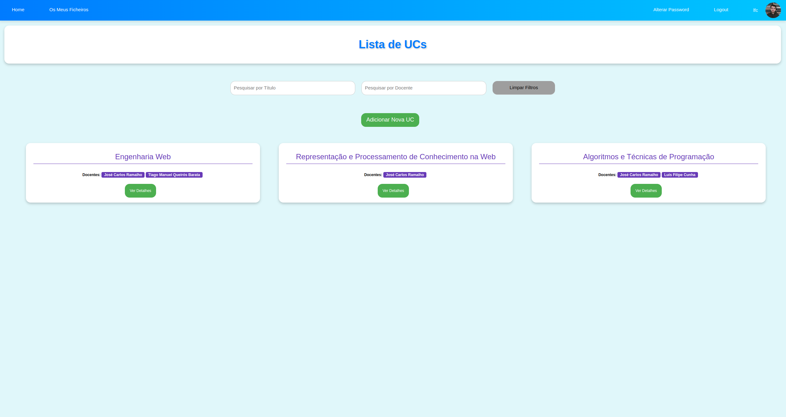

### Página Inicial (Administrador)

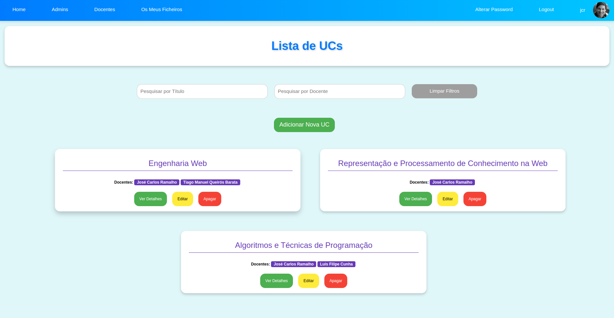

### Página de Login

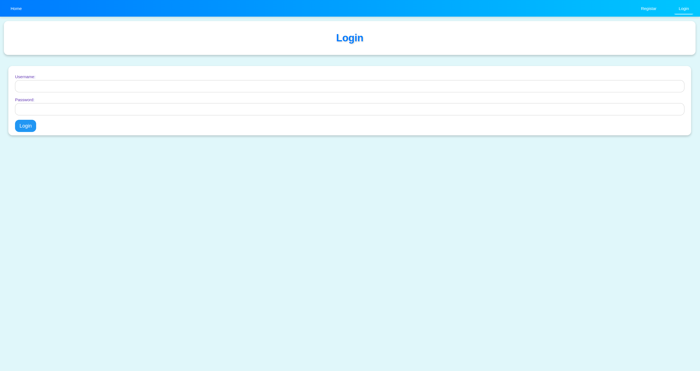

### Página de Registo

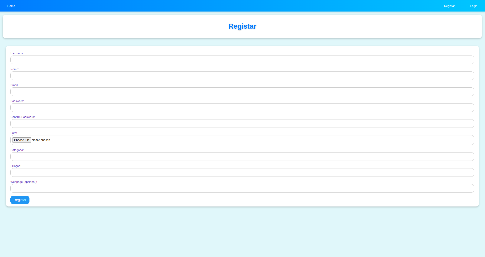

### Página de uma UC

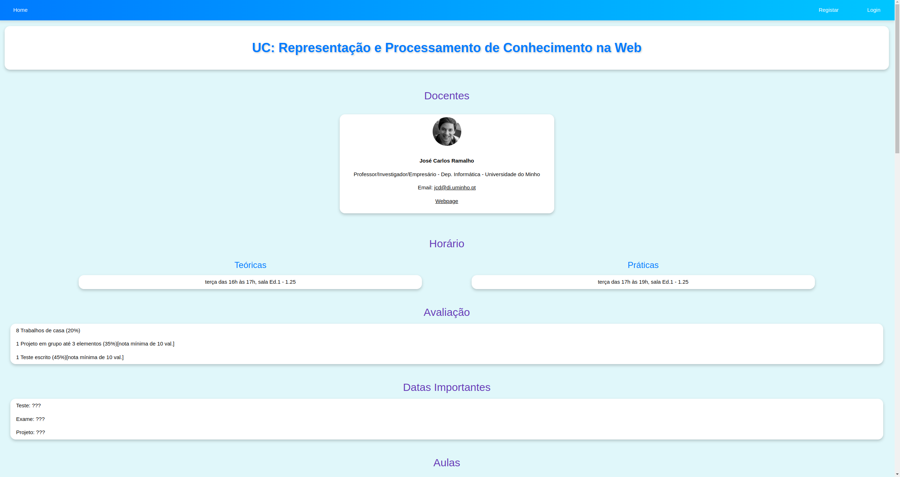
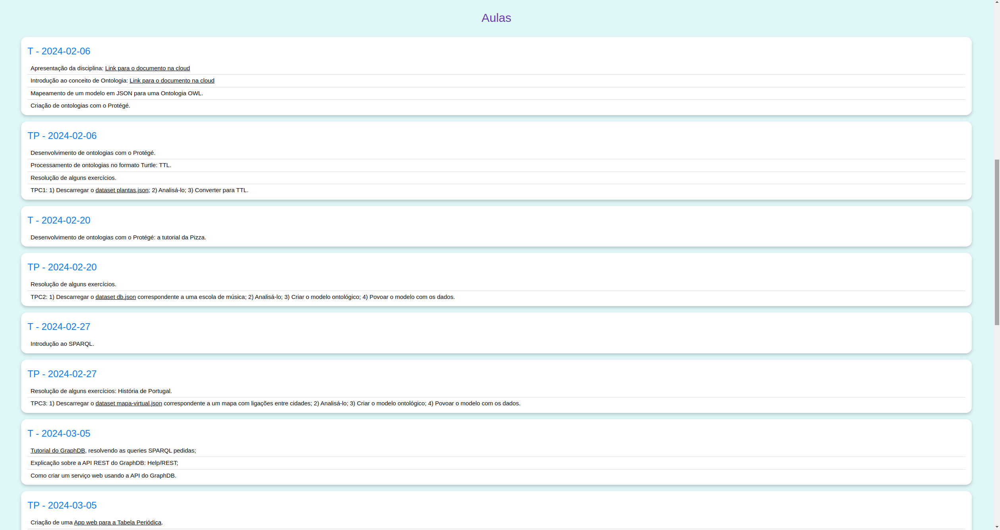

### Página da edição de uma UC

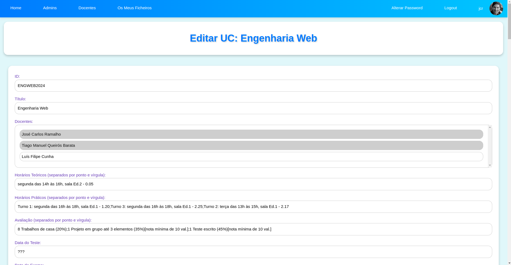
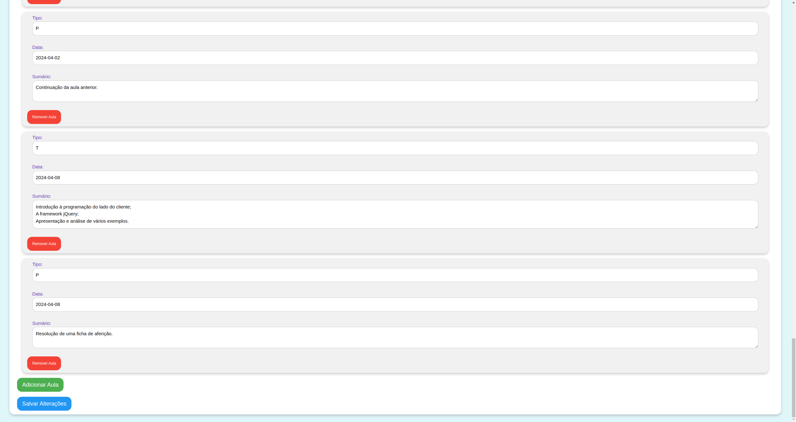

### Página de Adicionar uma UC

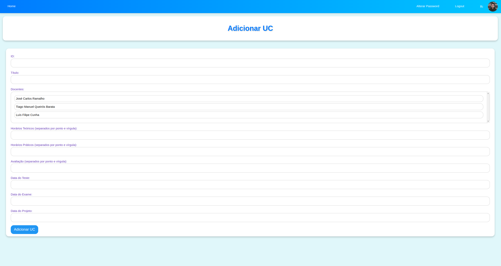

### Página de Obter Acesso a uma UC

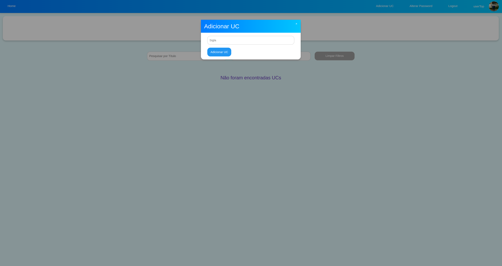

### Página de Ficheiros de um Utilizador

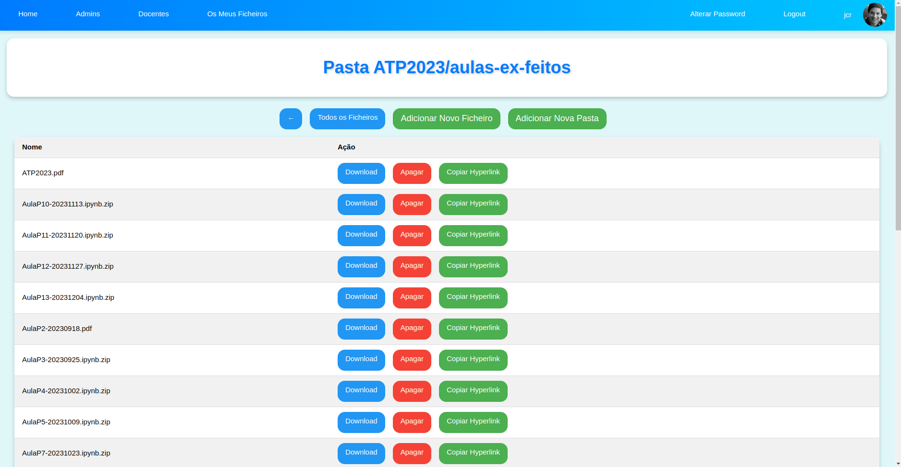
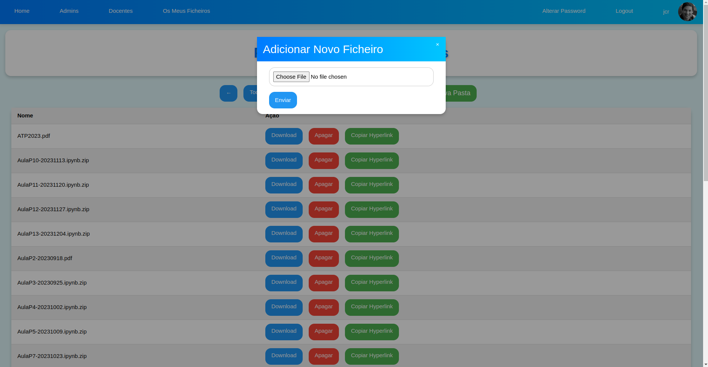


### Página de Mudar Password

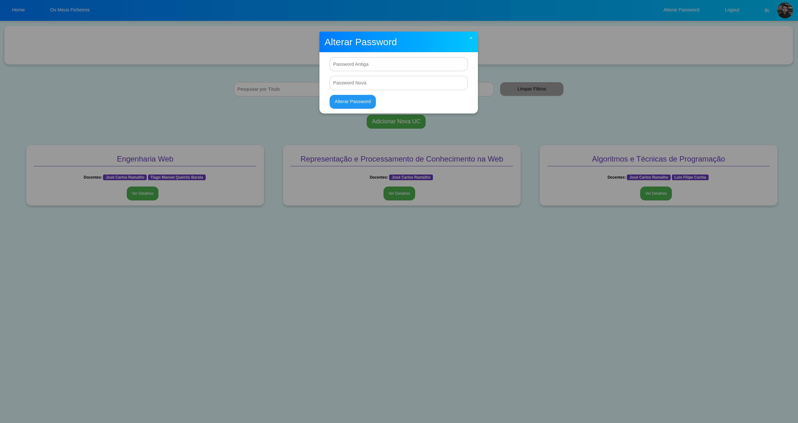

### Página de Gestão Administradores

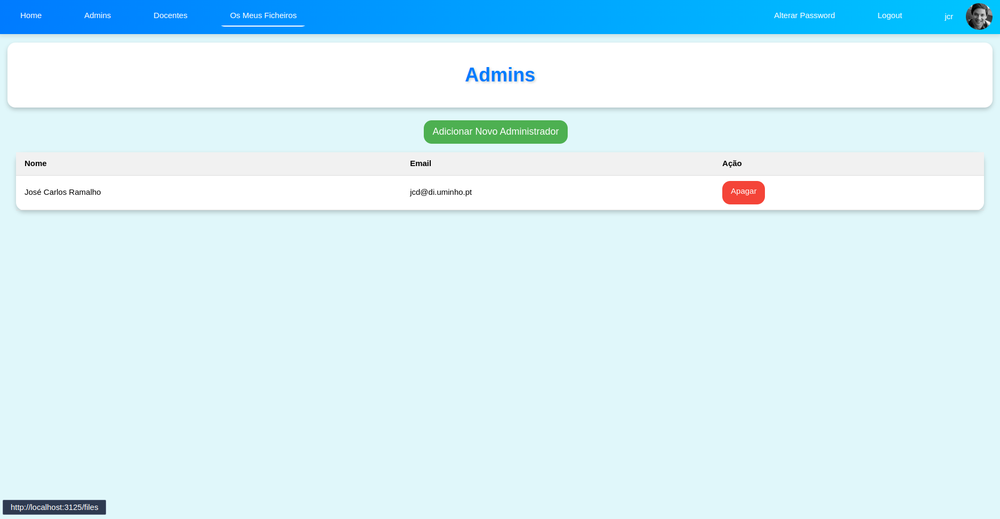

### Página de Adicionar Administrador

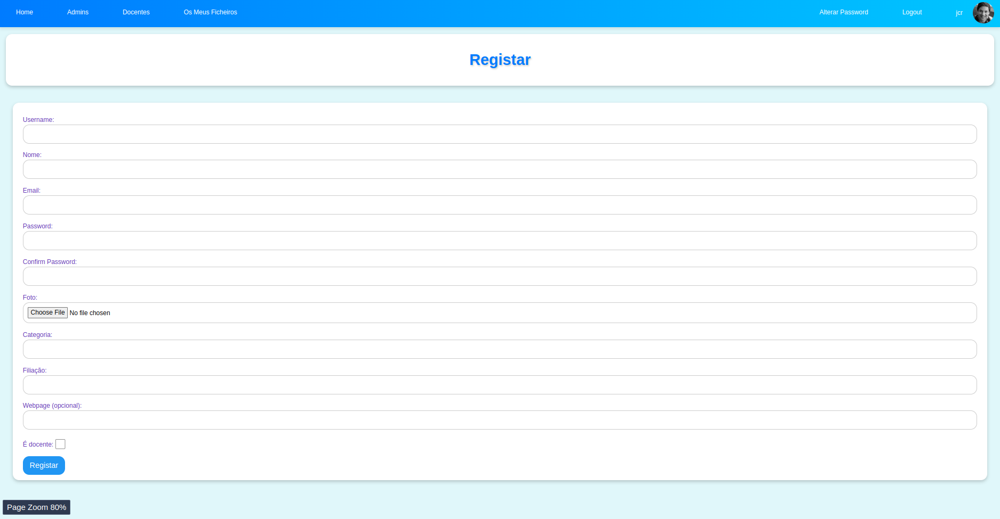

### Página de Gestão Docentes

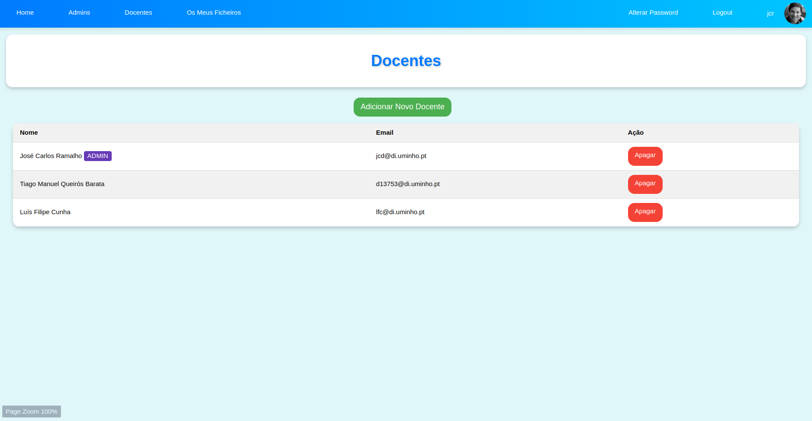

### Página de Adicionar Docente

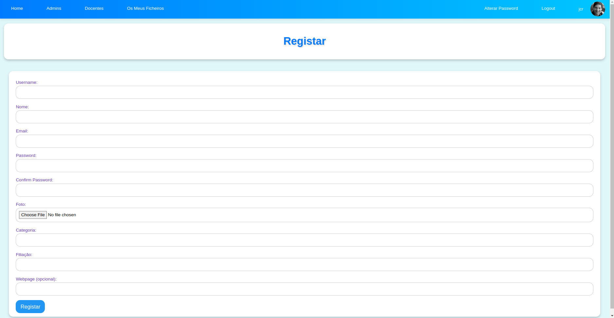

### Página de Sucesso

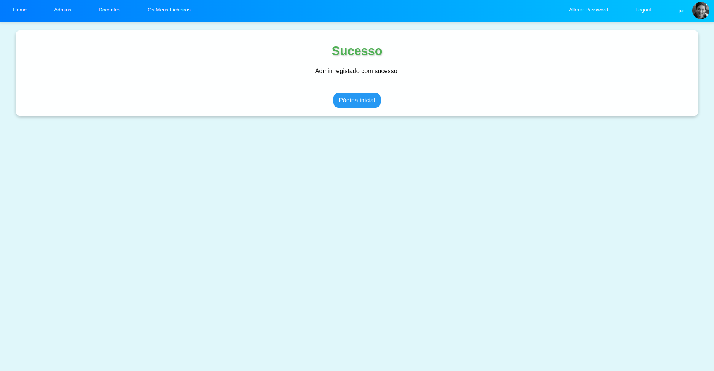

### Página de Erro

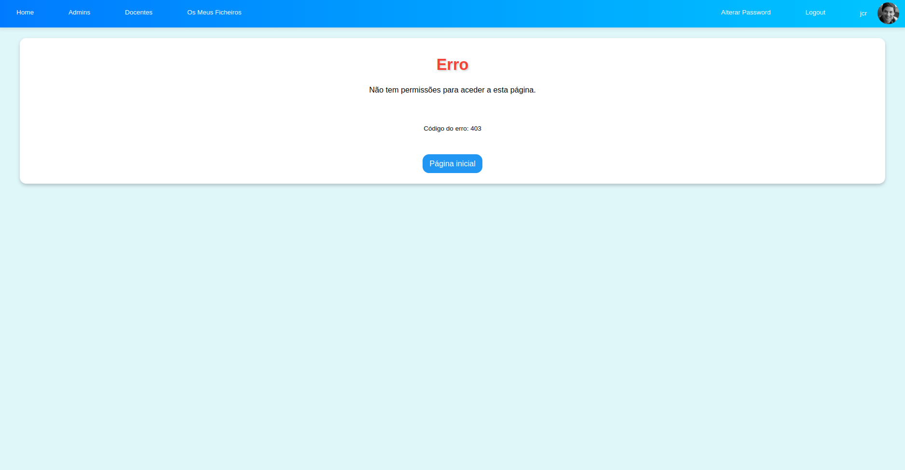
